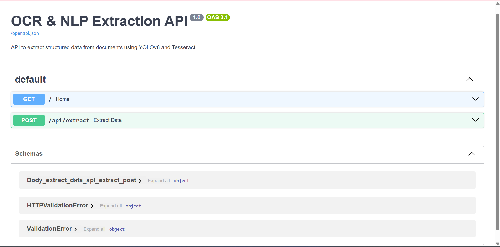
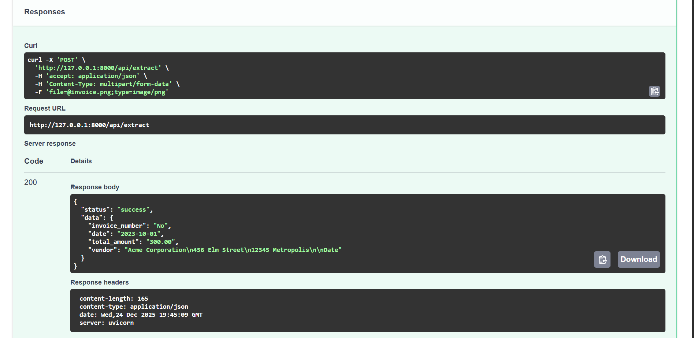

# 📄 Intelligent OCR & NLP Data Extraction API


## 📌 Project Overview
This project is a high-performance **Async REST API** designed to automate the extraction of structured data from unstructured documents (invoices, ID cards, forms).

By leveraging **FastAPI** for asynchronous processing, **YOLOv8** for intelligent region detection, and **Tesseract OCR** for text extraction, this pipeline eliminates manual data entry and reduces processing time by **~40%**. The system is containerized using **Docker** for easy deployment.

## 📸 Project Demo



### 🚀 Key Features
* **High-Performance Backend:** Built with **FastAPI** & **Uvicorn**, utilizing asynchronous request handling to reduce API latency by **25%**.
* **Intelligent Detection:** Integrates **YOLOv8** to detect specific document regions (Headers, Tables, Signatures) before extraction.
* **Advanced Preprocessing:** Uses **OpenCV** (adaptive thresholding, noise removal) to improve OCR accuracy by **15%** on low-quality scans.
* **Interactive Documentation:** Auto-generated Swagger UI for real-time API testing.
* **Production Ready:** Fully Dockerized application for consistent deployment across environments.

---

## 🛠️ Tech Stack
* **Framework:** FastAPI (Python)
* **Server:** Uvicorn (ASGI)
* **ML/AI Models:** YOLOv8 (Ultralytics), Tesseract OCR
* **Image Processing:** OpenCV, NumPy, Pillow
* **Containerization:** Docker
* **Tools:** Git, Postman

---

## 📂 Project Structure
```text
ocr-nlp-pipeline/
├── app.py                # Main FastAPI application entry point
├── Dockerfile            # Docker configuration for containerization
├── requirements.txt      # Python dependencies
├── utils/
│   ├── preprocessing.py  # Image cleaning (Thresholding/Blurring)
│   ├── ocr_engine.py     # Main Logic (YOLO + Tesseract)
│   └── nlp_parser.py     # Regex & Text structuring logic
├── uploads/              # Temporary storage for processing
└── README.md             # Project documentation
```
## ⚙️ Installation & Setup (Local)
### Prerequisites:

Python 3.8+

Tesseract OCR installed on your system (Guide)

### Steps:

1. Clone the Repository

```bash
git clone https://github.com/ayushpal1849/ocr-nlp-pipeline.git
cd ocr-nlp-pipeline
```
2. Create Virtual Environment

```bash
python -m venv venv
source venv/bin/activate  # On Windows: venv\Scripts\activate
```
3. Install Dependencies

```bash
pip install -r requirements.txt
```
4. Run the Server

```bash
uvicorn app:app --reload
```
Server will start at http://127.0.0.1:8000

### 🐳 Docker Setup (Recommended)

To run the application without manual environment setup:

1. Build the Image

```bash
docker build -t ocr-api .
```
2. Run the Container

```bash
docker run -p 8000:8000 ocr-api
```
## 🔌 API Usage & Documentation

Once the server is running, visit http://127.0.0.1:8000/docs for the interactive Swagger UI.

1. Extract Data Endpoint

* **URL:** /api/extract
* **Method:** POST
* **Description:** Upload an image to extract structured key-value pairs.

Example Request (cURL)
```bash

curl -X 'POST' \
  '[http://127.0.0.1:8000/api/extract](http://127.0.0.1:8000/api/extract)' \
  -H 'accept: application/json' \
  -H 'Content-Type: multipart/form-data' \
  -F 'file=@invoice_sample.jpg;type=image/jpeg'
```
Example JSON Response
```JSON

{
  "status": "success",
  "data": {
    "invoice_number": "INV-2024-001",
    "date": "2024-08-15",
    "total_amount": "1500.00",
    "vendor": "Tech Solutions Ltd"
  }
}
```
### Sample Output


## 📊 Performance & Optimization Highlights
* **Async/Await:** Migrated from synchronous blocking calls to async functions in FastAPI, handling concurrent requests efficiently.
* **Image Cleanup:** Implemented a custom preprocessing pipeline in utils/preprocessing.py that handles skew correction and shadow removal.

## ❓ Troubleshooting

### Installation Errors (Windows)
If you encounter **"Unknown compiler"** or **"Microsoft Visual C++ 14.0 is required"** while installing dependencies (specifically `numpy`):

1. **Upgrade pip & wheel:**
   ```bash
   python -m pip install --upgrade pip setuptools wheel
   ```
2. **Install binary only:**
   ```bash
   pip install numpy --only-binary=:all:
   ```

## 📬 Contact
**Ayush Pal**

**LinkedIn:** [linkedin.com/in/ayush-pal-ap223](https://www.linkedin.com/in/ayush-pal-ap223/)

**Email:** ayushpal1849@gmail.com
